# Learning Log – Network Toolkit

This log tracks my daily progress, concepts, and artifacts.

---

## [2026-02-15] – Day 1: Binary & IP Addressing

### Concept
- **What is a network?** (Kurose 1.1–1.2): packet switching, delay, loss.
- **Binary refresher:** IP addresses are 32‑bit numbers; each octet is 8 bits.
- **OSI model:** Drew it from memory three times to internalise layers.

### Artifact
- Created `src/ip_utils.py` with `dec_to_bin` and `bin_to_dec`.
- Key decision: used `zfill(8)` to ensure 8‑bit representation – essential for future bitwise ops with subnet masks.
- Added input validation to catch errors early.

### Reflection
-  Initially forgot to strip `'0b'` from `bin()` output – now I understand why slicing is needed.
- Validation taught me to think about edge cases before they cause bugs.

### Evidence
- Code committed with message: `Add binary conversion utilities for IP octets using bin() and int()`
- Test output:
192 -> 11000000 -> 192

- **OSI Model Drawing:**  
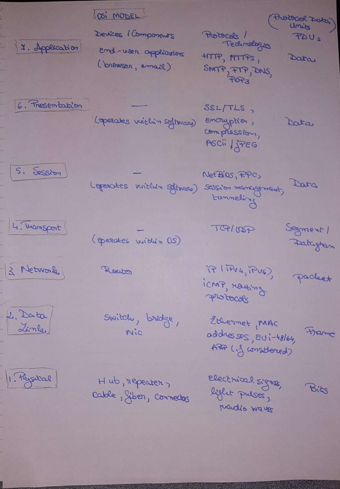  
*Hand‑drawn OSI model with layers and example devices.*

---
## [2026-02-16] – Day 2: IP Addressing & Subnetting Basics

### Concept
- IPv4 structure (network + host), classful vs CIDR, subnet masks.
- Subnetting formulas: network ID = IP & mask, hosts = 2^(32-mask) - 2.

### Artifact
- Extended `ip_utils.py` with:
  - `ip_to_bin()` – converts dotted decimal to 32‑bit binary.
  - `network_address()` – uses bitwise AND on binary strings.
  - `broadcast_address()` – OR with inverted mask.
  - `host_count()` – calculates usable hosts.
- Created `subnet_calculator.py` that imports these functions and prints results for a hardcoded example.

### Reflection
- Using string manipulation for bitwise ops is explicit and helps me visualise the process, though later I might switch to integer bitwise for performance.
- I solved 20 subnetting problems manually – the logic now feels solid.

### Evidence
- Code committed with message: `Add subnet calculation functions using bitwise operations`
- Packet Tracer simple LAN:
  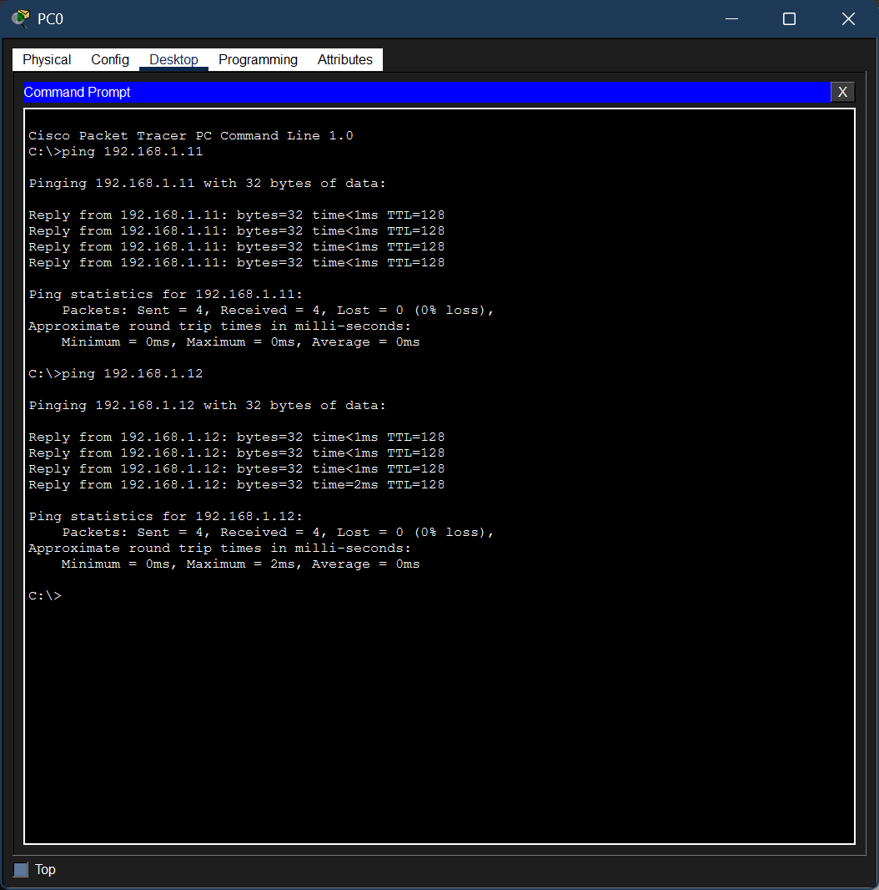
- Test output:
```
IP: 192.168.1.15
Mask: 255.255.255.0
Network address: 192.168.1.0
Broadcast address: 192.168.1.255
Usable hosts: 254
```


## [2026-02-17] – Day 3: Routing, ARP & Wireshark

### Concept
- Routers forward packets between subnets; each device needs a default gateway to reach other networks.
- ARP (Address Resolution Protocol) maps IP addresses to MAC addresses on a local link.
- Wireshark can capture and filter packets (ARP, ICMP) to observe these protocols in action.

### Artifact
- Built a Packet Tracer lab with two subnets connected by a router, verified cross‑subnet ping.
- Captured ARP and ICMP traffic during a ping, saved as `arp_icmp.png`.
- Enhanced `subnet_calculator.py` with an interactive menu and loop – now the user can perform multiple calculations until they choose to quit.

### Reflection
- Watching ARP in Wireshark made the theory concrete: the first ICMP echo request triggers an ARP request for the gateway's MAC.
- The interactive menu taught me to structure user input loops robustly – checking for 'quit' at each step prevents getting stuck.
- I reused `ip_utils` functions, keeping the calculator clean and focused on UI.

### Evidence
- Packet Tracer topology:  
  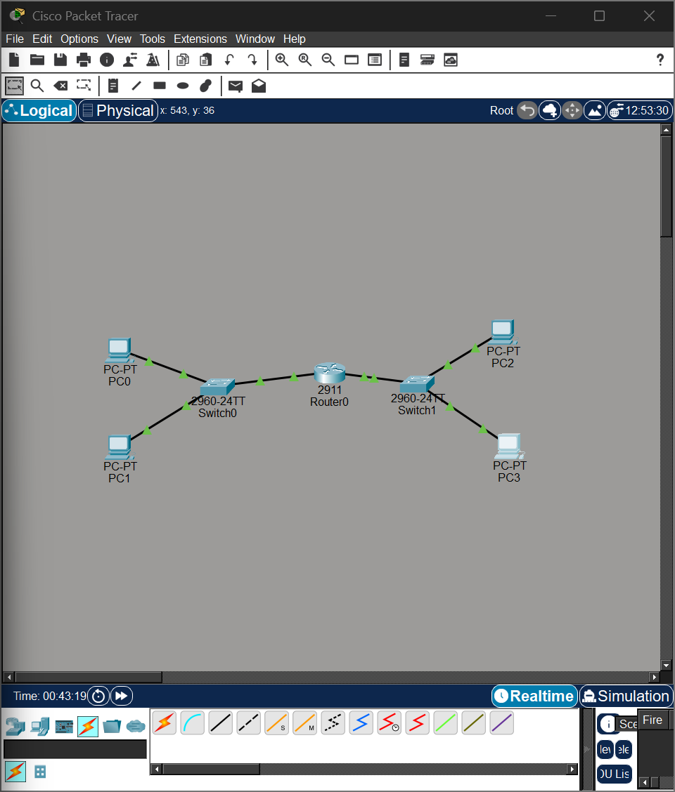
- Ping to left gateway:  
  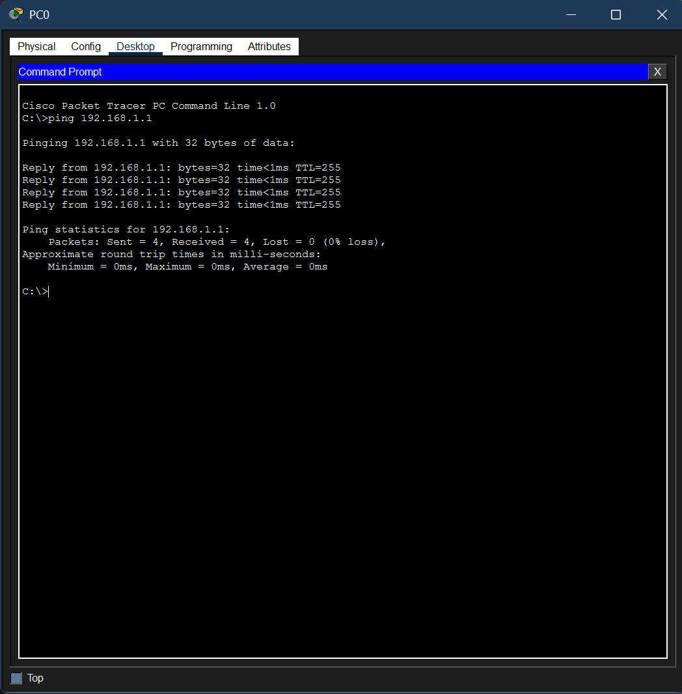
- Ping to right gateway:  
  
- Wireshark capture (ARP + ICMP):  
  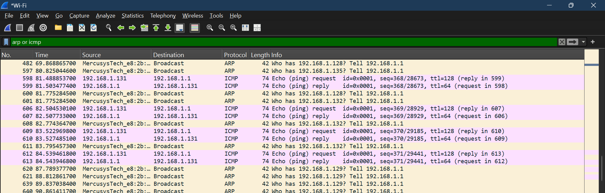

- Sample session:
```
=== Subnet Calculator ===
Enter IP address (e.g., 192.168.1.15): 192.168.1.15
Enter subnet mask (e.g., 255.255.255.0): 255.255.255.0

Results for 192.168.1.15 / 255.255.255.0:
Network address: 192.168.1.0
Broadcast address: 192.168.1.255
Usable hosts: 254

Another calculation? (y/n): n
Goodbye!
```

## [2026-02-18] – Day 4: TCP/UDP & Ports

### Concept
- Transport layer protocols: TCP (reliable, connection‑oriented) vs UDP (unreliable, connectionless).
- TCP three‑way handshake: SYN, SYN‑ACK, ACK.
- Port numbers multiplex connections; well‑known ports (HTTP 80, HTTPS 443, SSH 22, etc.).

### Artifact
- Wrote `tcp_client.py` – a reusable TCP client function `fetch_http()` that connects to a target, sends an HTTP GET request, and returns the response.
- Used a context manager and timeout for robustness.
- Captured a three‑way handshake on loopback (localhost) using Wireshark while connecting to a local HTTP server.

### Reflection
- Seeing the handshake in Wireshark made the theory concrete: the client sends SYN, server replies SYN‑ACK, client ACKs.
- The socket API maps directly to these steps: `connect()` triggers the handshake, `send()`/`recv()` transfer data.
- Debugging the HTTP request (initially got a 400 error) taught me to check the exact request string and line endings.

### Evidence
- Code committed with message: `Add TCP client with context manager and error handling`
- Wireshark capture of three‑way handshake on loopback:
  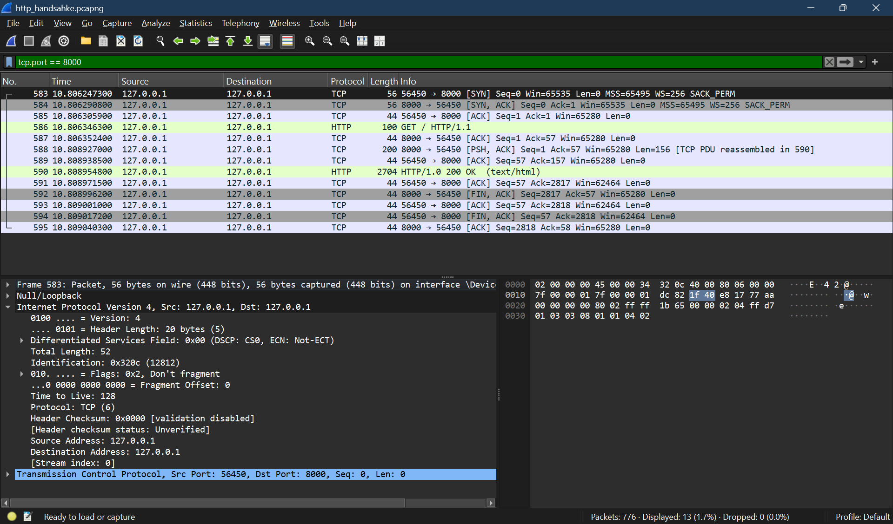
- Test output (local server):
```
[*] Connecting to 127.0.0.1:8000...
[+] Success. Received 2660 bytes.
Response snippet: <!DOCTYPE HTML>

<html lang="en"> <head> <meta charset="utf-8"> <title>Directory listing for /</title> </head> ...
```

## 2026-02-19 – Day 5: VLSM & Static Routing

### Concept

### VLSM (Variable Length Subnet Mask)
Allows subnetting a network into subnets of different sizes, using the most efficient allocation strategy (largest subnets first).

### Static Routing
Manually configuring routes on each router.  
Each router needs entries for networks not directly connected, specifying next-hop IPs on directly connected links.


### Artifact

#### 1. VLSM Practice

- Given `192.168.1.0/24`, created subnets of sizes `/26`, `/27`, `/28` manually.
- Calculated ranges and verified with online tools.

#### 2. Enhanced `subnet_calculator.py`
- Added **CIDR notation support** (e.g., `192.0.2.15/24`) via `parse_cidr()`.
- Implemented **first/last usable host calculation** with `get_host_range()` (handles edge cases like /31 and /32).
- Introduced **command‑line interface** using `argparse` – now can run:
  ```bash
  python -m src.subnet_calculator 192.0.2.15/24
  ```

- Refactored calculation logic into calculate_subnet() returning a dict, and print_results() for consistent output.

- Tested with many examples, including edge cases.

#### 3. Packet Tracer Static Routing Lab
- Built a three‑router chain (R1–R2–R3) with two end PCs using documentation prefixes:

  - PC1 LAN: 192.0.2.0/24 (R1 G0/0: .1, PC1: .10)
  - R1–R2 link: 198.51.100.0/30 (R1: .1, R2: .2)
  - R2–R3 link: 203.0.113.0/30 (R2: .1, R3: .2)
  - PC2 LAN: 192.0.2.64/26 (R3 G0/1: .65, PC2: .66)

- Configured static routes:

  - R1: `ip route 192.0.2.64 255.255.255.192 198.51.100.2`
  - R2:
    `ip route 192.0.2.0 255.255.255.0 198.51.100.1`
    
    `ip route 192.0.2.64 255.255.255.192 203.0.113.2`

  - R3: `ip route 192.0.2.0 255.255.255.0 203.0.113.1`

- Verified connectivity: ping from PC1 to PC2 – first packet timed out (ARP), subsequent pings succeeded.

### Reflection
- VLSM practice highlighted the importance of systematic allocation: always start with the largest subnet, then move to the next available block.

- Enhancing the calculator taught me to separate parsing, calculation, and output – making the code maintainable and testable.

- Static routing lab reinforced how routing tables work. I initially made IP typos on router interfaces, causing routes not to appear; double‑checking interface configurations fixed it.

### Evidence
Code committed with message:
Enhance subnet calculator with CIDR, host ranges, and argparse CLI

- Code committed with message:
`Enhance subnet calculator with CIDR, host ranges, and argparse CLI`

- Subnet calculator test (interactive):
```python
=== Advanced Subnet Calculator ===
Enter target network: 192.0.2.15/24

Results for 192.0.2.15 / 255.255.255.0:
    Network address:   192.0.2.0
    Broadcast address: 192.0.2.255
    First usable host: 192.0.2.1
    Last usable host:  192.0.2.254
    Usable hosts:      254
```
  - Subnet calculator CLI:
  ```python 
  $ python -m src.subnet_calculator 192.0.2.15/24
Results for 192.0.2.15 / 255.255.255.0:
    Network address:   192.0.2.0
    Broadcast address: 192.0.2.255
    First usable host: 192.0.2.1
    Last usable host:  192.0.2.254
    Usable hosts:      254
```
- Packet Tracer screenshots:
  - Topology:
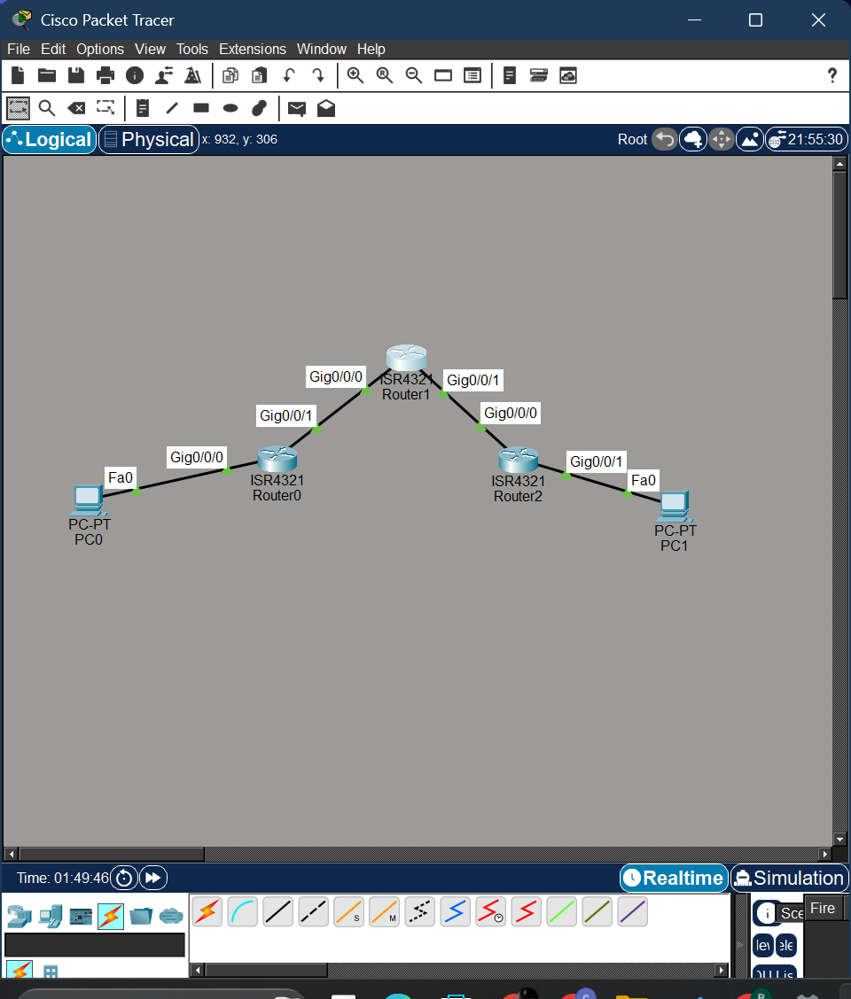

  - Routing tables:
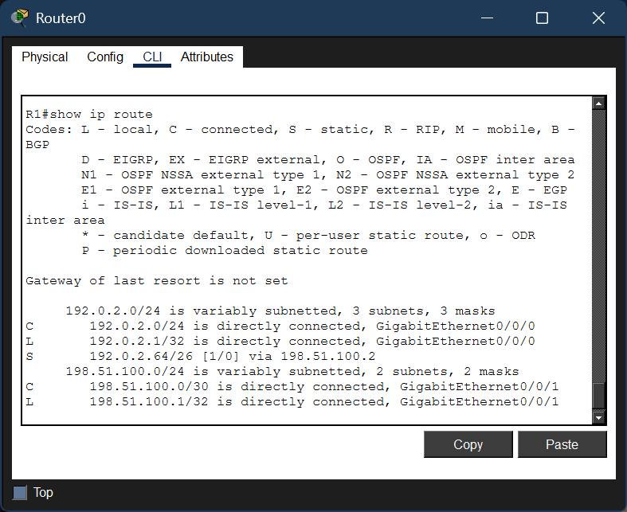
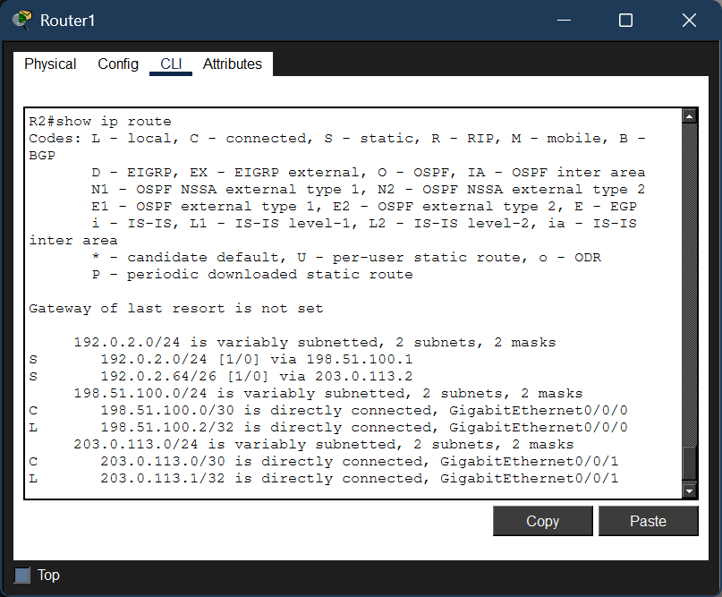
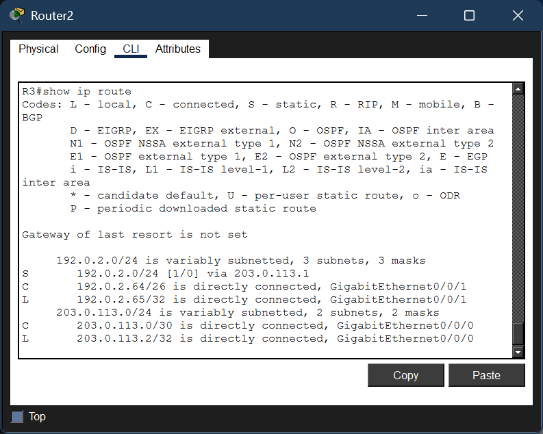
  - Ping test (first attempt had ARP timeout, second succeeded):
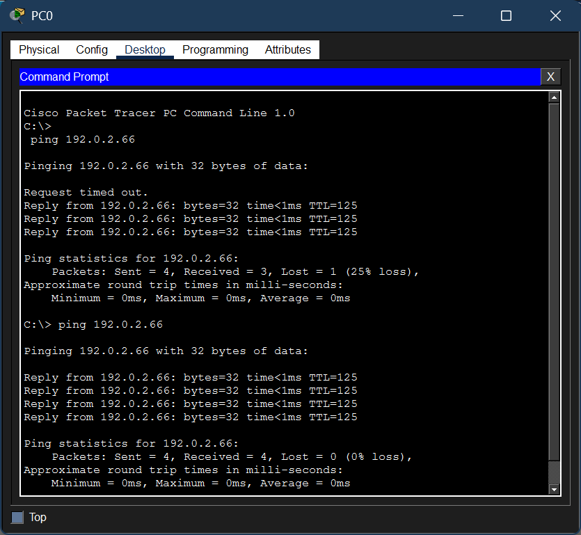

## [2026-02-20] – Day 6: Review, Test & Polish

### Concept
- Cumulative review of OSI model, subnetting, TCP handshake.
- Identifying and strengthening weak topics.
- Preparing the repository for public portfolio.

### Artifact
- No new code – focused on verification and documentation.
- Ran all scripts, confirmed they work.
- Updated README with Table of Contents and Week 1 summary.
- Verified all screenshots render correctly.
- Reviewed and polished code comments (fixed typos in ip_utils, tcp_client, subnet_calculator).

### Reflection
- Drawing OSI and TCP/IP models from memory helped lock the layers.
- Subnetting problems exposed a few lingering off‑by‑one errors – more practice helped.
- The practice assessment showed I need to review UDP header format – added Anki cards.
- Polishing the repo made me realise how much I've built in just one week. The structure is solid and ready for Week 2.

### Evidence
- Final commit: `docs: Final polish – add TOC, Week 1 summary, and verify screenshots`
- Updated README reflects all features and includes a summary.

## [2026-02-21] – Day 7: Real‑World Exploration & Week 2 Prep

### Concept
- Seeing how packets traverse the internet (traceroute).
- DNS resolution and mail exchanger lookup (nslookup).
- Installing tools for network scanning (Nmap, Scapy).

### Artifact
- Ran `tracert google.com` (IPv6 path, sanitized below).
- Looked up IP ownership using `lookup.icann.org` - early hops belong to my ISP, later ones to Google.
- Used `nslookup` to resolve google.com and query its MX records.
- Installed Nmap and Scapy to prepare for next week’s labs.

### Traceroute Output 

```
1 2 ms 1 ms 2 ms [my home router]
2 13 ms 6 ms 6 ms [ISP router 1]
3 21 ms 5 ms 6 ms [ISP router 2]
4 * * * Request timed out.
5 76 ms 50 ms 95 ms [ISP router 3]
6 * * * Request timed out.
7 119 ms 102 ms 98 ms 2a00:1450:80a0::1
8 114 ms 101 ms 100 ms 2001:4860:0:1::e92
9 115 ms 101 ms 100 ms 2001:4860:0:1::628b
10 110 ms 101 ms 99 ms lcbuda-an-in-x0e.1e100.net [2a00:1450:400d:803::200e]
```


### IP Lookup Results
- `2a00:1450:80a0::1` → belongs to **Google LLC** (Google’s infrastructure).
- `2a00:1450:400d:803::200e` → also **Google LLC**, the destination server.

### nslookup Example

```
nslookup google.com
Addresses: 2a00:1450:400d:802::200e
142.251.140.78
nslookup -type=MX google.com
google.com MX preference = 10, mail exchanger = smtp.google.com
```


### Reflection
- Traceroute reveals the path is not direct – packets traverse multiple ISP routers before reaching Google’s network. Timeouts at certain hops are normal; those routers are configured not to reply.
- `lookup.icann` lookups confirm that the infrastructure is operated by different organisations: my local ISP handles the first few hops, then hands off to Google’s own backbone.
- DNS is distributed – `nslookup` returned both IPv4 and IPv6 addresses for Google, showing how a single domain can have multiple IPs for load balancing and redundancy. The MX record points to Google’s mail servers, confirming they handle their own email.

## [2026-02-22] – Day 8: Ping Sweeper & Network Architecture

### Concept
- **Review & Subnetting:** Drew OSI/TCP models from memory; explained TCP 3‑way handshake out loud. Solved 30 mixed subnetting problems (including VLSM) – verified with calculator.
- **Python Ping Sweeper:** Used `subprocess`, `ipaddress`, `platform` to create a cross‑platform host discovery tool. Live progress indicator with percentage.
- **Network Architecture (Limoncelli Ch7):** Clean design, topologies (star, mesh), documentation importance.

### Chapter 7 Summary (Limoncelli)

- **OSI Model:** The OSI model is a conceptual framework that standardises network communication into seven layers, each with specific functions. It helps engineers troubleshoot by isolating problems to a specific layer – for example, a physical cable issue (Layer 1) vs. an IP addressing misconfiguration (Layer 3).

- **Clean Architecture:** Limoncelli describes clean network architecture as designs that are predictable, modular, and easy to document. This means avoiding unnecessary complexity, using consistent IP addressing schemes, and ensuring that changes in one part don't break others. My Packet Tracer labs follow this by keeping subnets organised and using documentation prefixes.

- **Network Topologies:** 
  - **Star:** All devices connect to a central switch – used in my simple LAN lab.
  - **Mesh:** Devices interconnect redundantly – my static routing lab is a partial mesh (chain).
  - **Bus:** Old coaxial Ethernet – rarely used today.
  - **Ring:** Each device connects to two neighbours – FDDI networks historically.
  
  *Real‑world example:* My home network uses a star topology – all devices connect to a central router/switch combo.

### Logical Topology Description

The drawing shows two of my Week 1 Packet Tracer labs. On the left, the simple LAN with three PCs (192.168.1.10, .11, .12) connected to a switch – a star topology. On the right, the two‑subnet lab: a router connects two switches, each with its own subnet (192.168.1.0/24 and 192.168.2.0/24). The router interfaces are labelled as gateways (.1 on each subnet). This is a Layer 3 (logical) diagram because it focuses on IP subnets and routing, not physical cable placement.

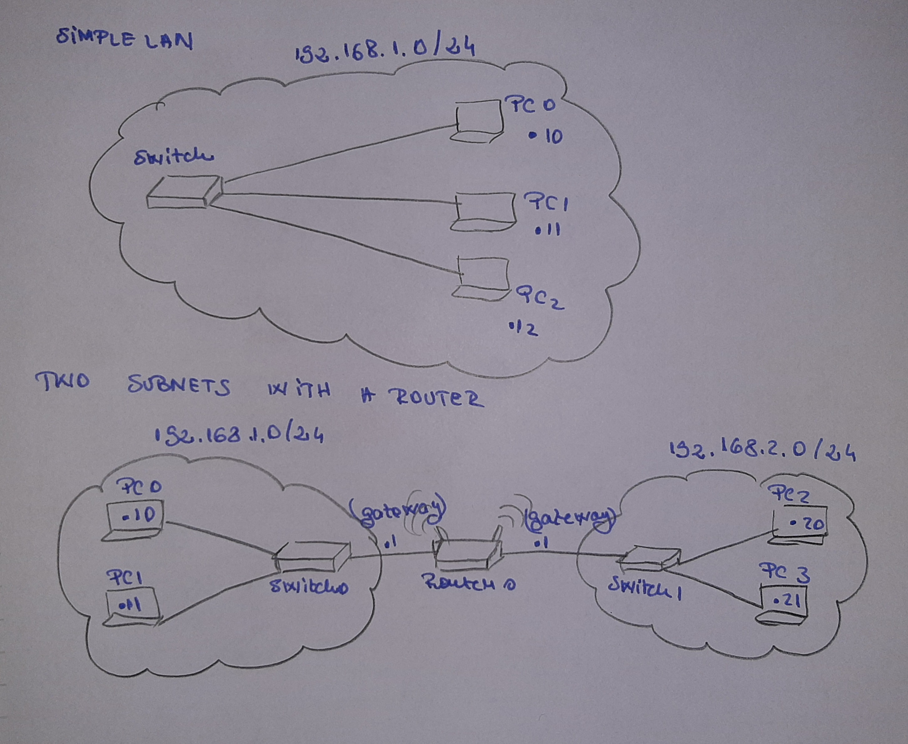

### Artifact
- Created `src/scanners/ping_sweeper.py` – cross‑platform ping sweep with progress bar and result storage.
- Drew logical topologies of Week 1 Packet Tracer labs (simple LAN, two subnets with router) – saved as `docs/images/topology_drawing.jpg`.

### Reflection
- **Ping sweeper:** The `platform` detection was essential – Windows uses milliseconds, Unix uses seconds. The progress bar (`\r`) made the tool feel professional; storing results in a dict prepares for later CSV/JSON export.
- **Network Architecture:** Limoncelli’s insistence on documentation validated my learning log approach. The topology drawing helped me visualise the difference between physical and logical design.
- **Subnetting:** Still catching occasional off‑by‑one errors – more practice needed, but speed is improving.

### Evidence
- Code committed: `Add cross‑platform ping sweeper with progress indicator`.

## [2026-02-23] – Day 9: Nmap Introduction & Port Scanning

---

## Concept

- **Nmap Basics:** Learned the difference between ping sweep (`-sn`) and port scanning (`-p`).
- **Scan Types:** TCP SYN scan (default for privileged users) vs TCP connect scan (for unprivileged users).
- **Port States:**
  - **open** → service is listening
  - **closed** → no service, responds with RST
  - **filtered** → firewall/ACL blocking the probe
- **Reading:** Lyon Ch1 (Introduction), Ch3 (Port Scanning Basics), sections 1.1–1.3, 3.1–3.2, 3.5.

---

## Artifact

### 1️⃣ Ping Sweep – Discover Live Hosts

```bash
nmap -sn 192.168.X.0/24
```
**Output:**

```text
Starting Nmap 7.98 ( https://nmap.org ) at 2026-02-24 00:52
Nmap scan report for 192.168.X.1
Host is up (0.029s latency).
MAC Address: AA:BB:CC:XX:XX:XX (Router Vendor)

Nmap scan report for 192.168.X.128
Host is up (0.085s latency).
MAC Address: XX:XX:XX:XX:XX:XX (Unknown)

Nmap scan report for 192.168.X.132
Host is up (0.13s latency).
MAC Address: XX:XX:XX:XX:XX:XX (Unknown)

Nmap scan report for 192.168.X.135
Host is up (0.13s latency).
MAC Address: XX:XX:XX:XX:XX:XX (Unknown)

Nmap scan report for 192.168.X.136
Host is up (0.15s latency).
MAC Address: XX:XX:XX:XX:XX:XX (Device Vendor)

Nmap scan report for 192.168.X.131
Host is up.

Nmap done: 256 IP addresses (6 hosts up) scanned in 5.25 seconds
```

### 2️⃣ Port Scan – Router (Ports 1–1000)

Output
```text
Starting Nmap 7.98 ( https://nmap.org ) at 2026-02-24 00:53
Nmap scan report for 192.168.X.1
Host is up (0.022s latency).
Not shown: 997 filtered tcp ports (no-response)

PORT    STATE     SERVICE
53/tcp  open      domain
80/tcp  open      http
443/tcp open      https

MAC Address: AA:BB:CC:XX:XX:XX (Router Vendor)

Nmap done: 1 IP address (1 host up) scanned in 7.66 seconds
```

### Limoncelli Ch10 Notes (Disaster Recovery)
- **Disaster definition:** Any event that makes a service unavailable (not just natural disasters).
- **Risk analysis:** Identify threats, vulnerabilities, and impact.
- **Data integrity:** Ensuring data is correct and consistent – backups, checksums, etc.

## Reflection

### 🔎 Ping Sweep (`-sn`)

- Found **6 live hosts** on my network.
- `.1` is the router; others are local devices.
- Nmap uses:
  - ICMP echo request
  - TCP SYN to port 443
  - TCP ACK to port 80
- Even if ICMP is blocked, hosts may still appear if they respond to TCP probes.

---

### 🔐 Port Scan

**Open ports:**

- 53 (DNS)
- 80 (HTTP)
- 443 (HTTPS)

- 997 ports reported as **filtered**.
- Likely due to the router firewall silently dropping packets instead of sending RST.
- This improves security by reducing information leakage.

---

### 🛡 OpSec

**Sanitised output:**

- Replaced real IPs with `192.168.X.X`
- Masked MAC addresses
- Removed vendor identifiers

Maintains privacy while preserving technical validity.

---

### 📖 Reading Notes

- SYN scan requires raw sockets → root privileges on Unix.
- Connect scan uses full TCP handshake → works without privileges.
- "Filtered" means Nmap cannot determine state because packets are dropped.

### Evidence
- Nmap commands executed and outputs logged above.
- Screenshots saved in `docs/images/` (sanitised).
- Limoncelli Chapter 10 notes added.

## [2026-02-25] – Day 10: Ping Sweeper Improvements & VLAN Lab

### Concept
- **Ping sweeper enhancements:** Using `argparse` to accept network ranges, storing results in a dictionary, printing summary, and adding error handling makes the tool more flexible and robust.
- **VLANs:** Logical segmentation of a switch into multiple broadcast domains. Hosts in the same VLAN can communicate at Layer 2; hosts in different VLANs need a Layer 3 device (router) to communicate.
- **Router‑on‑a‑stick:** A single router interface with 802.1Q trunking and subinterfaces routes between VLANs.

### Artifact
#### 1. Ping Sweeper Improvements (`ping_sweeper.py`)
- Added `argparse` to accept `--network` (default `192.168.1.0/24`).
- Store results in a dictionary `{ip: status}`.
- Print a summary: number of hosts up and down.

**Key code addition:**
```python
import argparse

parser = argparse.ArgumentParser(description='Ping sweep a network.')
parser.add_argument('--network', default='192.168.1.0/24', help='Network in CIDR notation')
args = parser.parse_args()
network_str = args.network
```

#### 2. VLAN Lab (Packet Tracer)
- Built a 2960 switch with four PCs.
- Created VLAN 10 (Sales) and VLAN 20 (Engineering).
- Assigned PC1, PC2 to VLAN 10; PC3, PC4 to VLAN 20.
- Verified intra‑VLAN connectivity and inter‑VLAN failure.
- Added a 2911 router with subinterfaces (`.10` and `.20`) and trunk port on the switch.
- Verified inter‑VLAN routing success.

**Key switch commands:**
```
vlan 10
 name Sales
vlan 20
 name Engineering
interface fa0/1
 switchport mode access
 switchport access vlan 10
! ... similar for other ports
interface fa0/5
 switchport mode trunk
 switchport trunk allowed vlan 10,20
```

**Key router commands:**
```
interface g0/0.10
 encapsulation dot1Q 10
 ip address 192.168.10.1 255.255.255.0
interface g0/0.20
 encapsulation dot1Q 20
 ip address 192.168.20.1 255.255.255.0
```

### Reflection
- The ping sweeper improvements make the script reusable for different networks and more user‑friendly. Storing results in a dictionary allows for later analysis (e.g., saving to a file).
- The VLAN lab clearly demonstrated that VLANs isolate traffic at Layer 2. Without a router, pings to different VLANs failed completely.
- Adding the router with a trunk and subinterfaces (router‑on‑a‑stick) successfully enabled communication between VLANs. The first ping after configuration timed out (ARP), but subsequent pings succeeded.
- Understanding the difference between access ports (single VLAN) and trunk ports (multiple tagged VLANs) is essential for network design.

### Screenshots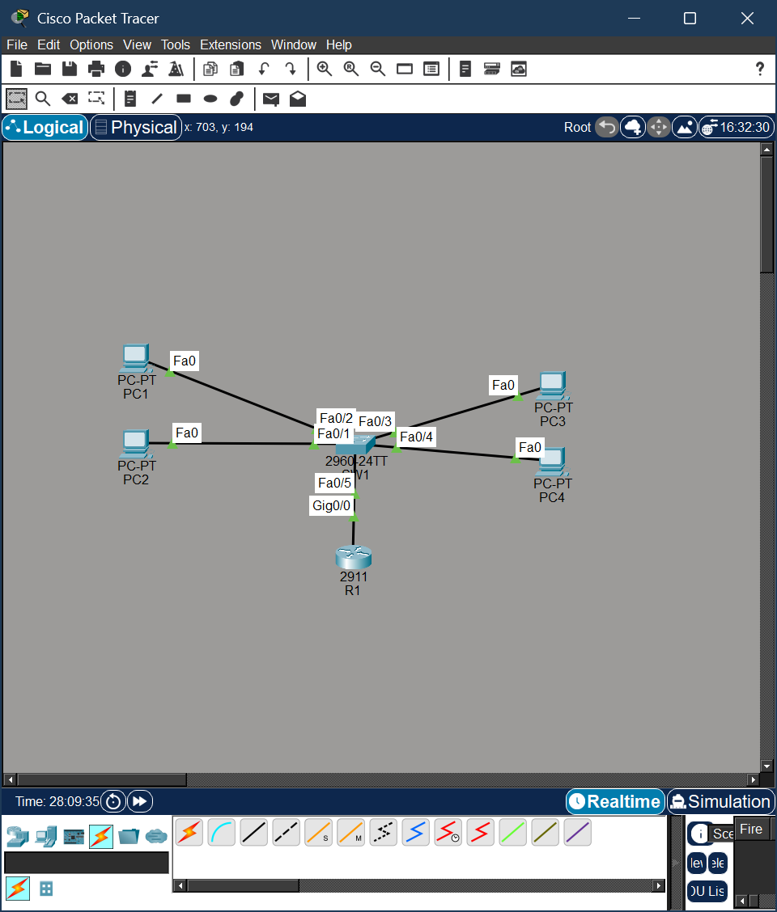
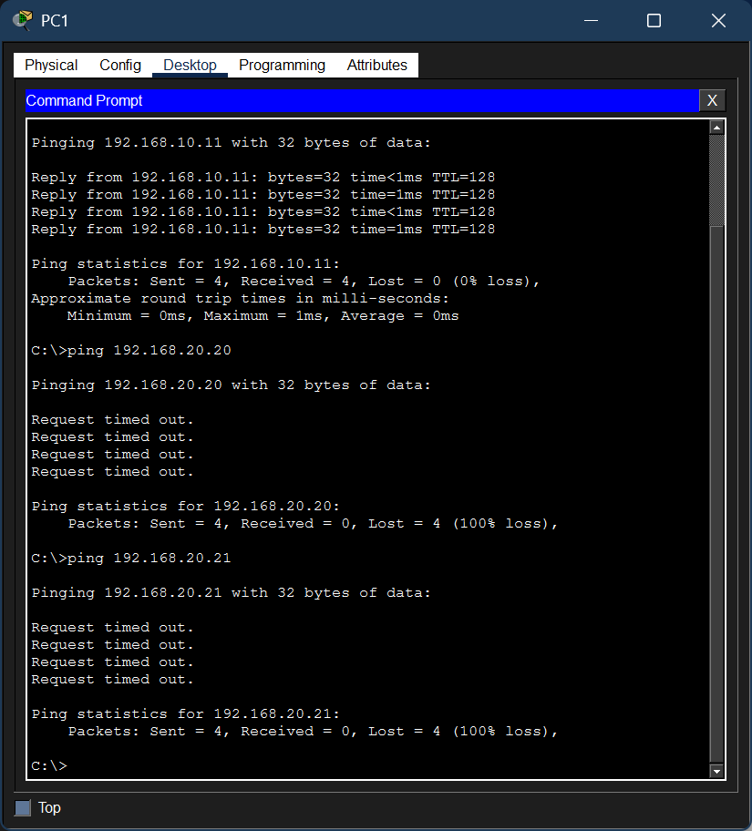
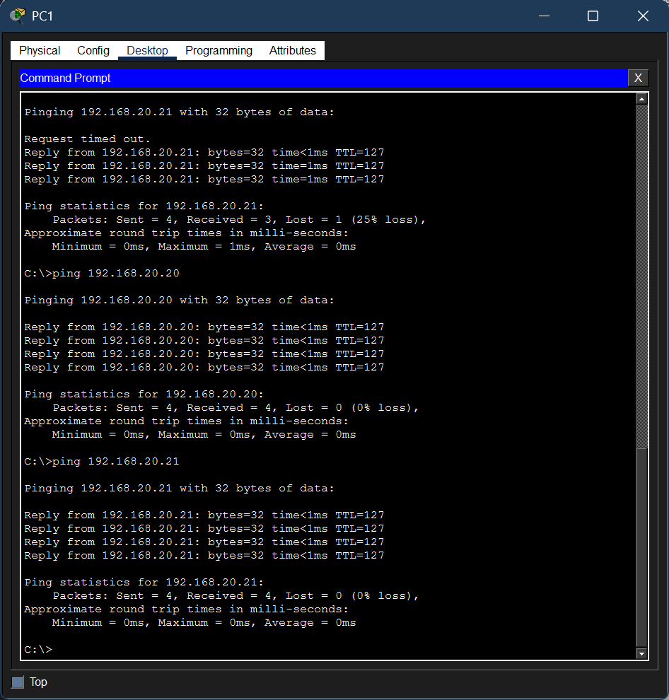